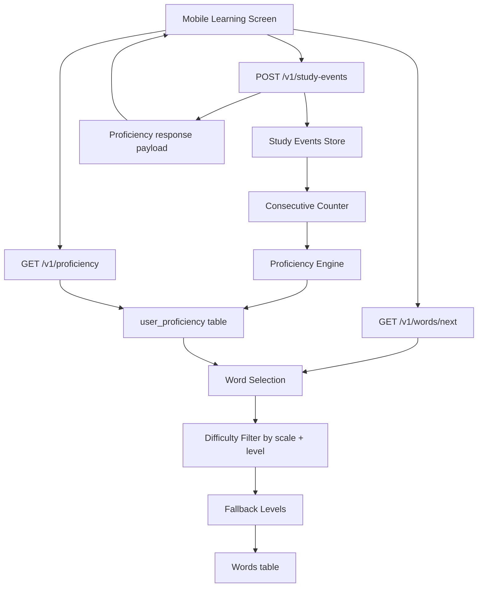

# Adaptive Proficiency Architecture

## Components

- Study event ingestion with rating validation.
- Consecutive rating evaluation for progression/regression.
- Proficiency persistence per device + language.
- Word retrieval with proficiency-aware filtering and fallback.
- Mobile feedback loop for level badge and level-change notifications.
