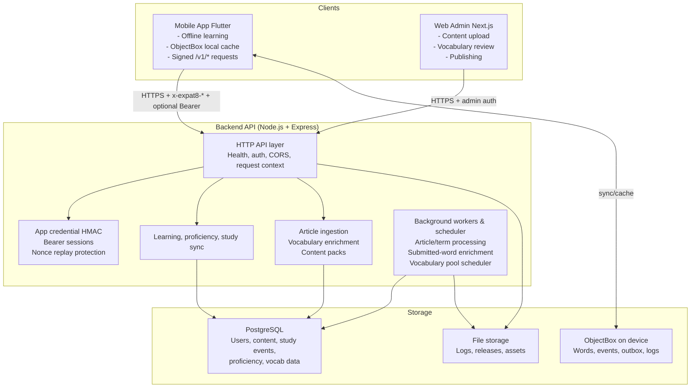

# Kiến trúc hệ thống Expat8 — Version 2

## Tổng quan

Expat8 là ứng dụng học từ vựng dành cho người Việt Nam theo mô hình **offline-first**. Người học có thể học ngay cả khi không có mạng nhờ local database và content cache trên mobile.

Khác với phiên bản trước, hệ thống **không còn tự sinh từ vựng hàng loạt bằng LLM**. Thay vào đó, hệ thống tiếp nhận **bài báo, bài viết, đoạn trích, nội dung học tập** từ:

* Người học upload qua Mobile App — yêu cầu register/login.
* Admin/teacher nhập hoặc post bài qua Web Admin — Next.js.
* API backend nhận content qua RESTful API.

Backend sẽ:

1. Lưu bài viết gốc.
2. Bóc tách từ/cụm từ xuất hiện trong bài.
3. Chuẩn hóa, deduplicate và gắn ngữ cảnh.
4. Enrich bằng LLM cho nội dung thật khi cần.
5. Lưu kết quả đã xử lý vào PostgreSQL và lưu file hỗ trợ khi cần.
6. Serve vocabulary/content pack lại cho người học.
7. Đồng bộ study events và SRS state dựa trên event log.



Điểm nhấn:

* Mobile là offline-first, backend là source of truth cho dữ liệu học.
* Request nặng được đẩy sang worker/scheduler, không nằm trong request path.
* Rate limit và replay protection được xử lý trong backend, không phụ thuộc Redis.

---

## 1. Nguyên tắc kiến trúc chính

### 1.1 Offline-first nhưng backend là source of truth cho dữ liệu học

Mobile vẫn cache dữ liệu học cục bộ để đảm bảo trải nghiệm nhanh và offline. Tuy nhiên:

* Backend là source of truth cho article, vocabulary, user account, study event log và SRS state chuẩn.
* Mobile là local execution/cache layer.
* Khi offline, mobile ghi study event vào local outbox.
* Khi online, mobile sync study events lên backend.
* Backend xử lý idempotency và cập nhật SRS state.

### 1.2 Không tin mobile secret như bí mật thật

Mobile vẫn có thể dùng app credential/HMAC như một lớp chống request lỗi hoặc bot sơ cấp, nhưng **không được coi mobile HMAC secret là bảo mật thật** vì secret có thể bị trích xuất từ APK/IPA.

Bảo mật thực sự dựa trên:

* User authentication bằng Bearer session token.
* Server-issued anonymous/device token nếu cần anonymous mode giới hạn.
* Rate limit theo IP/device/user.
* Replay protection bằng nonce store shared.
* Permission model rõ ràng.
* Abuse monitoring.

### 1.3 LLM không tự quyết định kho từ vựng

LLM không còn được dùng để sinh từ hàng loạt. LLM chỉ được dùng để **enrich vocabulary từ nội dung thật**.

Ví dụ:

* Input: bài báo tiếng Anh.
* Backend extract cụm từ: `economic slowdown`, `interest rate cut`, `consumer confidence`.
* LLM giải thích nghĩa, cách đọc, ví dụ, lỗi thường gặp, bản dịch tiếng Việt.
* Kết quả được lưu vào DB và có thể được review trước khi serve rộng rãi.

### 1.4 Study events là source of truth cho SRS

Không để mobile gửi state cuối cùng rồi backend tin tuyệt đối. Mobile gửi **study events**. Backend dùng study events để cập nhật hoặc tái dựng `user_word_states`.

---

## 2. Luồng dữ liệu cốt lõi

### 2.1 First install / first launch

```text
main()
  │
  ├─ 1. Mở ObjectBox local DB
  ├─ 2. seedFromBundleIfEmpty(languages)
  │       └─ assets/seed_vocab/{en,zh,vi}.json
  │
  ├─ 3. Load anonymous/device token nếu có
  ├─ 4. Load cached content packs nếu có
  ├─ 5. runApp(LearningScreen)
  │       └─ user thấy thẻ đầu tiên ngay nếu local DB có dữ liệu
  │
  └─ 6. [background]
          ├─ syncPendingStudyEvents()
          ├─ syncContentPackVersions()
          ├─ fetchDueCardsIfNeeded()
          └─ fetchProficiency()
```

### 2.2 User upload bài viết qua Mobile App

Yêu cầu: user phải register/login.

```text
User login
  │
  ├─ Mobile chọn/paste/upload bài viết
  │
  ├─ POST /v1/articles
  │     ├─ Authorization: Bearer <session_token>
  │     ├─ title
  │     ├─ source_url optional
  │     ├─ language
  │     ├─ raw_text
  │     └─ visibility: private | shared
  │
  ├─ Backend lưu article với status = 'pending_processing'
  │
  ├─ Backend enqueue article_processing_job
  │
  └─ Mobile nhận article_id + processing_status
```

Mobile có thể hiển thị:

```text
Article uploaded. Vocabulary is being prepared.
```

Khi worker xử lý xong, mobile sync để lấy vocabulary mới.

### 2.3 Admin post bài qua Web Admin Next.js

```text
Admin login Web Admin
  │
  ├─ Tạo article/content item
  ├─ Chọn language, level target, topic, visibility
  ├─ Submit qua REST API
  │
  └─ Backend enqueue processing job
```

Admin có thể review kết quả extract/enrich trước khi publish:

```text
pending_processing
  → processing
  → pending_review
  → approved
  → published
```

### 2.4 Article processing pipeline

```text
article_processing_job
  │
  ├─ 1. Load article raw_text
  ├─ 2. Clean text
  │     ├─ remove boilerplate
  │     ├─ normalize whitespace
  │     └─ detect language
  │
  ├─ 3. Extract candidate terms/phrases
  │     ├─ tokenizer
  │     ├─ n-gram phrase extraction
  │     ├─ POS/heuristic filters
  │     ├─ frequency in article
  │     └─ stopword filtering
  │
  ├─ 4. Normalize and deduplicate
  │     ├─ normalized_term
  │     ├─ lemma/base form if available
  │     └─ duplicate against existing terms/senses
  │
  ├─ 5. LLM enrichment
  │     ├─ meaning_vi
  │     ├─ pronunciation guide
  │     ├─ IPA/pinyin if applicable
  │     ├─ part of speech
  │     ├─ example from article
  │     ├─ extra example sentence
  │     ├─ Vietnamese explanation
  │     ├─ common mistakes
  │     └─ estimated level
  │
  ├─ 6. Validation
  │     ├─ JSON schema validation
  │     ├─ language validation
  │     ├─ profanity/safety filter
  │     ├─ required fields check
  │     └─ confidence/quality score
  │
  ├─ 7. Store results
  │     ├─ article_terms
  │     ├─ terms
  │     ├─ word_senses
  │     └─ vocabulary_items
  │
  └─ 8. Mark article status
        ├─ pending_review for admin content
        └─ processed for private user content
```

### 2.5 Learning card serving flow

User-facing request chỉ đọc dữ liệu đã có. Không gọi LLM trong request path.

```text
POST /v1/learning/cards
  │
  ├─ Authenticate user/session/device
  ├─ Apply rate limit
  ├─ Load user SRS state
  ├─ Select due review cards
  ├─ Select new cards from approved/processed vocabulary
  ├─ Exclude already assigned/recently seen cards
  └─ Return batch cards
```

Nếu thiếu card:

```text
return fewer cards
or return fallback seed/general cards
```

Request path không gọi LLM. Phần generate/enrich chạy ở worker hoặc scheduler nền.

---

## 3. Backend modules

Backend code lives in `backend/src/`. Core runtime files are top-level, and domain routers live under `backend/src/routes/`.

```text
backend/src/
├─ server.js                      — HTTP server entry point
├─ worker.js                      — Background worker entry point
├─ runtime.js                     — Builds store, scheduler, and server runtime
├─ app.js                         — Express app factory and middleware stack
├─ config.js                      — Env parsing and validation
├─ app_credentials.js             — HMAC signing/verification + nonce cache
├─ rate_limit.js                  — In-process sliding-window rate limiter
├─ user_identity.js               — Password hashing and session token management
├─ word_store.js                  — In-memory store for tests/dev
├─ postgres_word_store.js         — PostgreSQL store for production
├─ article_processing_pipeline.js — Article extraction/enrichment pipeline
├─ article_processing_worker.js   — Claim/process article jobs
├─ submitted_word_worker.js       — Process user-submitted words
├─ passage_segmentation_worker.js — Passage segmentation jobs
├─ passage_enrichment_worker.js   — Passage enrichment jobs
├─ vocabulary_pool_scheduler.js   — Background vocabulary top-up scheduler
├─ vocabulary_enrichment_adapter.js — LiteLLM adapter for enrichment
├─ generation_service.js          — Vocabulary generation service used by workers
├─ litellm_client.js              — LiteLLM API client
├─ log_archive_store.js           — Sanitized mobile log archive storage
├─ release_store.js               — Release storage abstraction
├─ postgres_release_store.js      — PostgreSQL release store
├─ database.js, logger.js, ids.js, normalize.js, store_utils.js
└─ routes/                        — auth, articles, admin, learning, study-events,
                                   proficiency, content-packs, speaking, exam,
                                   user, releases, memorization
```

---

## 4. API endpoints

### 4.1 Public/system

| Method | Path             | Mục đích                 | Auth        |
| ------ | ---------------- | ------------------------ | ----------- |
| GET    | `/health`        | Health check (liveness)  | No          |
| GET    | `/health/ready`  | Readiness check (DB ping) | No/Internal |

### 4.2 Auth

| Method | Path                 | Mục đích                     | Auth                        |
| ------ | -------------------- | ---------------------------- | --------------------------- |
| POST   | `/v1/users/register` | Đăng ký tài khoản            | App credential + rate limit |
| POST   | `/v1/users/sign-in`  | Đăng nhập                    | App credential + rate limit |
| POST   | `/v1/users/sign-out` | Đăng xuất                    | Bearer token                |
| GET    | `/v1/me`             | Lấy profile/session hiện tại | Bearer token                |

### 4.3 Articles

| Method | Path                          | Mục đích                  | Auth                                |
| ------ | ----------------------------- | ------------------------- | ----------------------------------- |
| POST   | `/v1/articles`                | User upload bài viết      | Bearer token                        |
| GET    | `/v1/articles`                | List bài user đã upload   | Bearer token                        |
| GET    | `/v1/articles/:id`            | Xem chi tiết bài          | Bearer token + ownership            |
| GET    | `/v1/articles/:id/vocabulary` | Lấy vocab bóc tách từ bài | Bearer token + ownership/visibility |
| DELETE | `/v1/articles/:id`            | Xóa/ẩn bài user upload    | Bearer token + ownership            |

### 4.4 Admin content

| Method | Path                               | Mục đích                       | Auth        |
| ------ | ---------------------------------- | ------------------------------ | ----------- |
| POST   | `/v1/admin/articles`               | Admin tạo bài học              | Admin token |
| GET    | `/v1/admin/articles`               | List content                   | Admin token |
| PATCH  | `/v1/admin/articles/:id`           | Update metadata/status         | Admin token |
| POST   | `/v1/admin/articles/:id/reprocess` | Chạy lại extraction/enrichment | Admin token |
| POST   | `/v1/admin/articles/:id/publish`   | Publish bài                    | Admin token |
| GET    | `/v1/admin/review/vocabulary`      | Review vocab pending           | Admin token |
| PATCH  | `/v1/admin/vocabulary/:id`         | Sửa/approve/reject vocab       | Admin token |

### 4.5 Learning and sync

| Method | Path                    | Mục đích                                | Auth                                 |
| ------ | ----------------------- | --------------------------------------- | ------------------------------------ |
| POST   | `/v1/learning/cards`    | Lấy batch cards                         | Bearer token or limited device token |
| POST   | `/v1/study-events`      | Gửi single study event                  | App credential + optional Bearer     |
| POST   | `/v1/study-events/sync` | Batch sync study events                 | App credential + optional Bearer     |
| PUT    | `/v1/user-word-cache`   | Cập nhật advisory word cache của device | App credential + optional Bearer     |
| GET    | `/v1/proficiency`       | Lấy level hiện tại                      | App credential + optional Bearer     |
| GET    | `/v1/content-packs`     | List content pack versions              | App credential + optional Bearer     |
| GET    | `/v1/content-packs/:id` | Download content pack                   | App credential + optional Bearer     |

---

## 5. Security model

### 5.1 App credential/HMAC

App credential HMAC vẫn có thể được giữ lại để:

* Chặn request thiếu header chuẩn.
* Giảm spam sơ cấp.
* Có thêm tín hiệu nhận diện app build.
* Hỗ trợ replay protection.

Nhưng app credential **không được coi là bí mật tuyệt đối** vì nằm trong mobile binary.

```text
Mobile HMAC = weak app authenticity signal
Bearer token = user/session authentication
Device token = server-issued device identity
Rate limit = abuse control
Nonce store = replay protection
```

### 5.2 Nonce store

Không giữ nonce trong RAM nếu cần replay protection qua nhiều instance.

Backend dùng `InMemoryNonceCache` cho local/test. Khi có PostgreSQL, runtime sẽ dùng `PostgresNonceCache` để claim nonce bằng bảng `nonces`.

```sql
CREATE TABLE nonces (
  app_id TEXT NOT NULL,
  nonce TEXT NOT NULL,
  expires_at TIMESTAMPTZ NOT NULL,
  PRIMARY KEY (app_id, nonce)
);
```

`PostgresNonceCache` prune expired rows lazily và fail-open khi DB lỗi để không khóa người dùng hợp lệ.

### 5.3 Rate limit

Rate limit theo nhiều dimension:

```text
IP address
user_id
session_id
device_id
endpoint
article upload size
study event sync volume
login attempts
admin actions
```

Ví dụ policy:

| Endpoint                | Limit                                     |
| ----------------------- | ----------------------------------------- |
| `/v1/users/sign-in`     | 5 attempts / 10 minutes / IP + identifier |
| `/v1/users/register`    | 10 / hour / IP                            |
| `/v1/articles`          | 20 uploads / day / user                   |
| `/v1/learning/cards`    | 120 requests / hour / user/device         |
| `/v1/study-events/sync` | 3000 events / hour / user/device          |
| `/v1/admin/*`           | stricter + audit log                      |

### 5.4 Auth model

User session:

```text
session_token = random 256-bit
server stores SHA256(session_token)
mobile stores token in secure storage
```

Admin session:

* Separate role: `admin`, `editor`, `reviewer`.
* Web Admin should use secure HTTP-only cookies if same domain.
* All admin actions audit logged.

### 5.5 Article ownership and visibility

```text
private: chỉ owner xem/học
shared: owner + selected users/groups
published: mọi user có thể học
admin_published: official content
```

---

## 6. Study event idempotency and SRS source of truth

### 6.1 Study event là source of truth

Mobile không gửi state cuối cùng như `mastered`, `ease_factor`, `next_review_at` để backend tin tuyệt đối.

Mobile gửi events:

```json
{
  "event_id": "evt_01HX...",
  "word_sense_id": "ws_01HX...",
  "article_id": "art_01HX...",
  "rating": "easy",
  "occurred_at": "2026-05-09T08:00:00Z",
  "client_sequence": 1024,
  "device_id": "dev_01HX..."
}
```

Backend:

1. Check duplicate by `event_id`.
2. Insert event if new.
3. Update SRS state deterministically.
4. Return accepted/duplicate/rejected counts.

### 6.2 Idempotency rules

Database constraint:

```sql
CREATE UNIQUE INDEX study_events_event_id_uidx
ON study_events(event_id);
```

Optional stronger scope:

```sql
CREATE UNIQUE INDEX study_events_user_event_uidx
ON study_events(user_id, event_id);
```

Sync response:

```json
{
  "accepted_event_ids": ["evt_1", "evt_2"],
  "duplicates": ["evt_3"],
  "rejected_events": [
    {
      "event_id": "evt_4",
      "client_event_id": null,
      "reason": "unknown_word_sense"
    }
  ],
  "proficiency": {
    "level": "A1"
  }
}
```

### 6.3 SRS update policy

Backend maintains:

```text
user_word_states:
  user_id
  word_sense_id
  status
  ease_factor
  interval_days
  repetitions
  lapses
  last_rating
  last_seen_at
  next_review_at
  updated_at
```

Card selection uses:

```text
1. due review cards: next_review_at <= now()
2. weak cards: low ease_factor / recent hard ratings
3. new cards from current article/content pack
4. fallback seed/general cards
```

### 6.4 Conflict handling

If events arrive late from offline device:

* Use `occurred_at` to preserve learning timeline.
* Use `received_at` for audit.
* Do not blindly overwrite state by client timestamp.
* For MVP, process events in order of `(occurred_at, received_at, event_id)`.
* For advanced version, rebuild user_word_state from study_events if needed.

---

## 7. Content ingestion and vocabulary model

### 7.1 Article schema concept

```text
articles:
  id
  owner_user_id nullable
  created_by_admin_id nullable
  title
  source_url nullable
  language
  raw_text
  cleaned_text
  topic nullable
  target_level nullable
  visibility
  status
  processing_error nullable
  created_at
  updated_at
```

### 7.2 Term and sense model

Không unique trực tiếp theo `(language, normalized_term)` nếu muốn hỗ trợ nhiều nghĩa.

```text
terms:
  id
  language
  display_term
  normalized_term
  lemma nullable
  created_at
```

```text
word_senses:
  id
  term_id
  part_of_speech
  meaning_vi
  short_definition
  pronunciation
  ipa nullable
  pinyin nullable
  level_scale
  level
  topic nullable
  quality_score
  status
  created_at
  updated_at
```

Một term có thể có nhiều sense:

```text
bank
  → ngân hàng
  → bờ sông
```

### 7.3 Article-term relationship

```text
article_terms:
  id
  article_id
  term_id
  word_sense_id nullable
  surface_text
  sentence_context
  start_offset
  end_offset
  frequency
  extraction_confidence
  created_at
```

### 7.4 Vocabulary enrichment output

LLM output cần strict JSON schema:

```json
{
  "term": "economic slowdown",
  "language": "en",
  "part_of_speech": "noun phrase",
  "meaning_vi": "sự giảm tốc kinh tế",
  "short_definition": "A period when economic growth becomes slower.",
  "pronunciation_guide_vi": "i-kờ-NOM-mik SLOW-đaon",
  "ipa": "/ˌiːkəˈnɑːmɪk ˈsloʊdaʊn/",
  "example_from_article": "...",
  "extra_example": "The country faced an economic slowdown after exports declined.",
  "extra_example_vi": "Quốc gia đó đối mặt với sự giảm tốc kinh tế sau khi xuất khẩu giảm.",
  "common_mistake_vi": "Không nên dịch từng chữ là 'chậm xuống kinh tế'.",
  "level_scale": "cefr",
  "estimated_level": "B2",
  "confidence": 0.87
}
```

---

## 8. Web Admin Next.js

### 8.1 Mục đích

Web Admin dùng cho admin/teacher/content editor để:

* Post bài viết.
* Import bài từ URL hoặc paste raw text.
* Chọn language, topic, target level.
* Theo dõi trạng thái processing.
* Review vocabulary do backend extract và LLM enrich.
* Approve/reject/sửa từ/cụm từ.
* Publish bài học.

### 8.2 Module frontend

```text
expat8-dashboard/
├─ app/
│  ├─ login/
│  ├─ articles/
│  │  ├─ page.tsx
│  │  ├─ new/page.tsx
│  │  └─ [id]/page.tsx
│  ├─ vocabulary-review/
│  ├─ content-packs/
│  └─ settings/
│
├─ components/
│  ├─ ArticleEditor.tsx
│  ├─ VocabularyReviewTable.tsx
│  ├─ ProcessingStatusBadge.tsx
│  └─ PublishControls.tsx
│
└─ lib/
   ├─ apiClient.ts
   ├─ auth.ts
   └─ validators.ts
```

### 8.3 Admin workflow

```text
Create article
  → Submit
  → Processing
  → Review extracted vocab
  → Edit/reject bad items
  → Approve
  → Publish
  → Mobile users can learn
```

---

## 9. Mobile architecture updates

### 9.1 Module structure

```text
mobile/lib/
├─ main.dart                          — App bootstrap, DI wiring, seed + refresh init
├─ objectbox.g.dart                   — Generated ObjectBox bindings
└─ src/
   ├─ config.dart                     — AppConfig.fromEnvironment() (dart-define)
   ├─ telemetry.dart                  — Basic event telemetry helpers
   │
   ├─ api/
   │  └─ backend_api_client.dart      — Signs requests (HMAC), handles Bearer token
   │
   ├─ data/
   │  ├─ local_database.dart          — ObjectBox open/close, log persistence + pruning
   │  ├─ local_database_entities.dart — ObjectBox entity definitions
   │  ├─ seed_vocabulary_loader.dart  — Loads bundled seed vocab from assets/
   │  └─ word_repository.dart         — ObjectBox queries, backend sync, device ID
   │
   ├─ logging/
   │  └─ logger.dart                  — PersistedLogger writing to ObjectBox
   │
   ├─ models/
   │  ├─ proficiency_state.dart
   │  ├─ study_event.dart
   │  ├─ sync_queue_entry.dart
   │  ├─ user_session.dart
   │  └─ vocabulary_word.dart
   │
   ├─ session/
   │  ├─ card_selection.dart          — Card selection logic (new vs review)
   │  └─ learning_session_controller.dart — ChangeNotifier driving LearningScreen
   │
   └─ ui/
      ├─ learning_screen.dart         — Main card UI
      ├─ vocabulary_card.dart         — Individual card widget
      ├─ logs_screen.dart             — In-app log viewer
      └─ log_share_service.dart       — Share logs as text
```

### 9.2 Local entities

```text
LocalWordEntity
LocalWordSenseEntity
LocalArticleEntity
LocalArticleTermEntity
StudyEventEntity
SyncQueueEntity
AppSettingEntity
AppLogEntity
```

### 9.3 Upload bài từ mobile

```text
User opens Upload Article
  │
  ├─ Paste text / upload file / share article text into app
  ├─ App validates length/language
  ├─ POST /v1/articles
  ├─ Save local article status = uploaded/processing
  └─ Poll or background sync until processed
```

### 9.4 Offline learning

Mobile vẫn học offline từ:

* Seed bundle.
* Previously downloaded article vocabulary.
* Published content packs.
* User-uploaded processed articles đã sync về.

---

## 10. Database schema — high-level

### 10.1 Auth and identity

```text
users
user_sessions
user_devices
admin_users
roles
permissions
```

### 10.2 Security and abuse prevention

```text
nonces
rate_limit_events optional
api_audit_logs
```

### 10.3 Content ingestion

```text
articles
article_processing_jobs
article_terms
terms
word_senses
vocabulary_review_items
content_packs
content_pack_items
```

### 10.4 Learning and SRS

```text
study_events
user_word_states
user_word_assignments
user_proficiency
```

### 10.5 Observability

```text
audit_logs
processing_runs
llm_enrichment_runs
```

---

## 11. Migration tool

Không dùng `database.js apply schema` cho production.

Dùng migration tool chính thức. Với Node.js có thể chọn một trong các hướng:

### Option A: Knex migrations

Phù hợp nếu muốn SQL rõ ràng, nhẹ, dễ kiểm soát.

```text
backend/src/db/migrations/
  202605090001_create_users.js
  202605090002_create_articles.js
  202605090003_create_terms_and_senses.js
  202605090004_create_study_events.js
```

### Option B: Prisma migrations

Phù hợp nếu muốn ORM/schema-first.

Trade-off: tiện nhưng có thể nặng nếu hệ thống muốn kiểm soát SQL chi tiết.

### Option C: Drizzle migrations

Phù hợp nếu muốn TypeScript-native, nhẹ hơn Prisma.

### Recommendation

Với backend Express hiện tại, chọn **Knex migrations hoặc Drizzle**.

Nếu ưu tiên đơn giản, dễ debug, ít magic:

```text
Knex migrations + raw SQL/repository layer
```

Production flow:

```text
CI/CD
  ├─ run tests
  ├─ build backend
  ├─ run db migrations
  ├─ deploy app
  └─ health/readiness check
```

---

## 12. Deployment update

### 12.1 Services

```yaml
services:
  postgres:
    image: postgres:16-alpine

  backend:
    build: ./backend
    command: npm start

  article-worker:
    build: ./backend
    command: npm run start:worker

  expat8-dashboard:
    build: ./expat8-dashboard
    command: npm run start
```

### 12.2 Environment variables

```text
DATABASE_URL
PORT
APP_CREDENTIALS_JSON
APP_CREDENTIAL_TIMESTAMP_SKEW_SECONDS
APP_CREDENTIAL_NONCE_TTL_SECONDS
APP_CREDENTIAL_GET_BODY_LIMIT_BYTES
APP_CREDENTIAL_POST_BODY_LIMIT_BYTES
LITELLM_BASE_URL
LITELLM_API_KEY
LITELLM_MODEL
DEFAULT_SOURCE_LANGUAGE
DEFAULT_TARGET_LANGUAGE
NEW_WORD_TIMEOUT_SECONDS
LOG_ARCHIVE_DIR
LOG_ARCHIVE_RETENTION_DAYS
LOG_ARCHIVE_MAX_TOTAL_BYTES
LOG_ARCHIVE_UPLOAD_BODY_LIMIT_BYTES
ADMIN_API_TOKENS
ARTICLE_WORKER_INTERVAL_MS
ARTICLE_WORKER_MAX_ATTEMPTS
LOG_LEVEL
LOG_REDACTION_ENABLED
```

---

## 13. Observability

### 13.1 Backend metrics

```text
http_request_duration_ms
http_request_count
rate_limit_rejected_count
hmac_replay_rejected_count
article_uploaded_count
article_processing_duration_ms
article_processing_failed_count
terms_extracted_count
vocabulary_enrichment_success_count
vocabulary_enrichment_failure_count
llm_enrichment_cost_estimate
study_events_accepted_count
study_events_duplicate_count
study_events_rejected_count
learning_cards_served_count
```

### 13.2 Mobile metrics

```text
time_to_first_card
card_selection_latency_ms
local_db_query_latency_ms
study_event_outbox_size
study_event_sync_failure_count
article_upload_success_count
article_upload_failure_count
content_pack_sync_failure_count
watchdog_fire_count
```

---

## 14. Revised MVP scope

### Included in MVP v2

* Register/login.
* Mobile offline learning from seed bundle.
* User upload article via Mobile App.
* Admin post article via Next.js Web Admin.
* Background workers for article processing, submitted-word enrichment, and passage processing.
* Term/phrase extraction.
* LLM vocabulary enrichment from real content.
* Study event idempotency.
* Backend-owned SRS state.
* Rate limiting.
* App credential nonce cache (in-memory/Postgres).
* DB migrations.

### Excluded from MVP v2

* Fully automatic web scraping.
* Public social feed.
* Complex teacher/classroom model.
* Pronunciation scoring.
* Multi-tenant school management.
* Payment/subscription.
* Advanced spaced repetition algorithm tuning.

---

## 15. Updated architecture assessment

Version 2 is stronger because:

* It avoids uncontrolled LLM vocabulary generation.
* Vocabulary comes from real user/admin content.
* LLM is used as enrichment, not as the source of truth.
* User-facing APIs no longer depend on slow/costly LLM calls.
* SRS correctness is based on study events.
* Security model no longer pretends mobile app secret is truly secret.
* Backend can scale API and worker separately.
* Admin can review and control content quality.

This architecture is suitable for:

```text
MVP → private beta → controlled production
```

Before large-scale production, still need:

* Strong content moderation.
* Better LLM output evaluation.
* Backup/restore discipline.
* Admin audit trail.
* Crash reporting for mobile.
* Cost monitoring for LLM enrichment.
